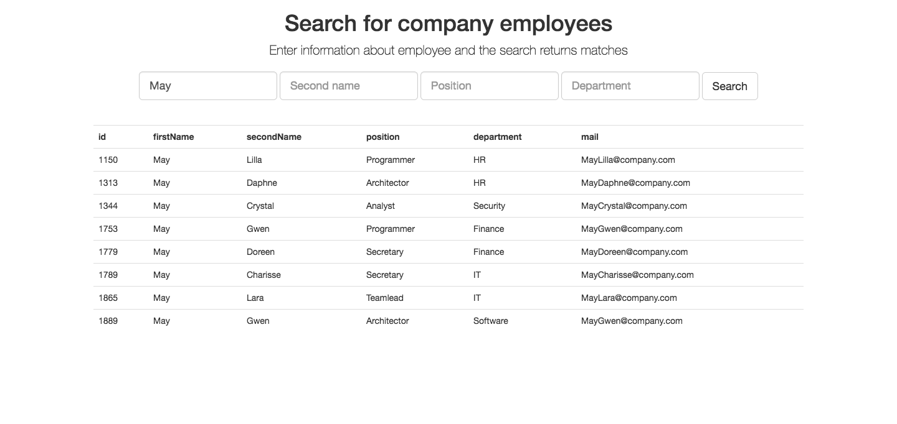

# EmployeeSearchWebApp (SpringMVC + Hibernate)
______________________________________________
#### One-page web application with forms for employee search
Searches for an employee and displays the search result:

###### Realization:
* Spring MVC provide main page
* JS script form AJAX request to server
* Server generate JSON with list of employee
using Hibernate
* Script reciev JSON and form the table

_______________________________________________
###### To do:
* Replace specific implementations with interfaces
* Handle possible exceptions(server-side, JS, HTML-inection)
* Create messages for wrong search request("null-form", "there are no employee")
* Correct H2 in main page
